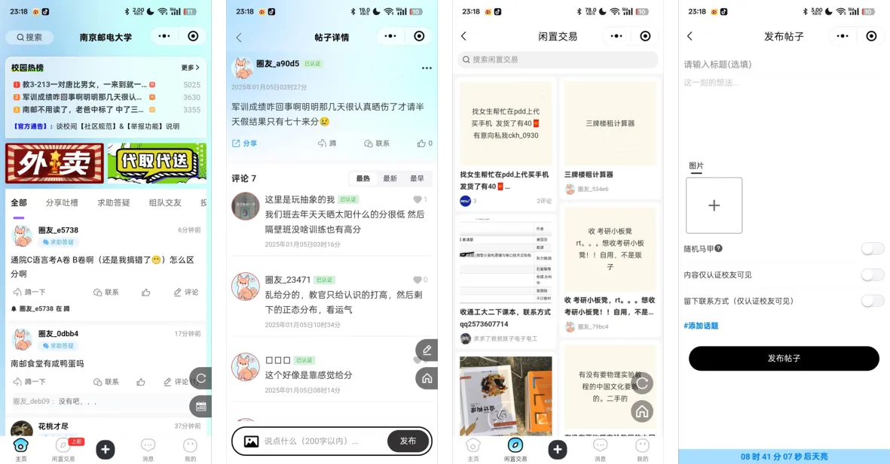
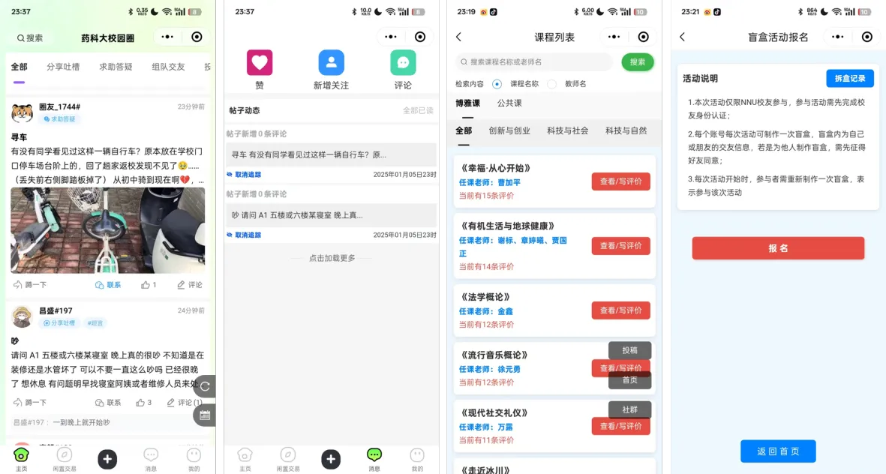
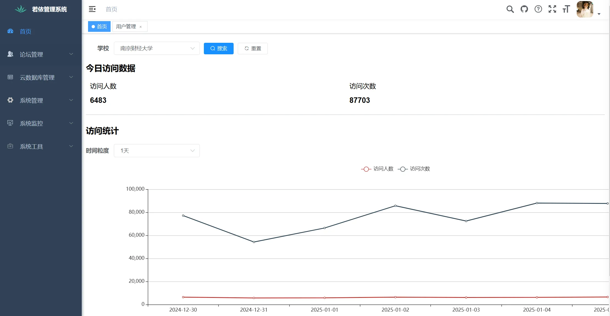
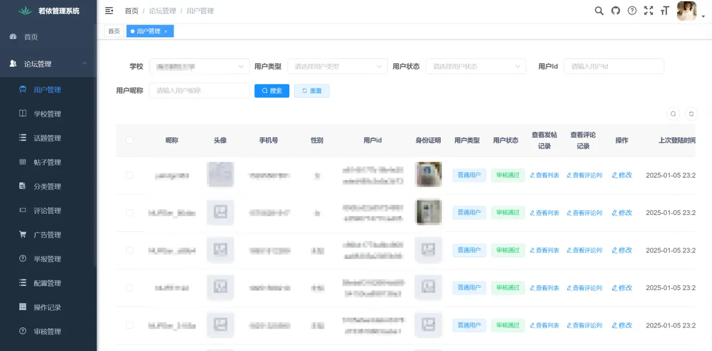
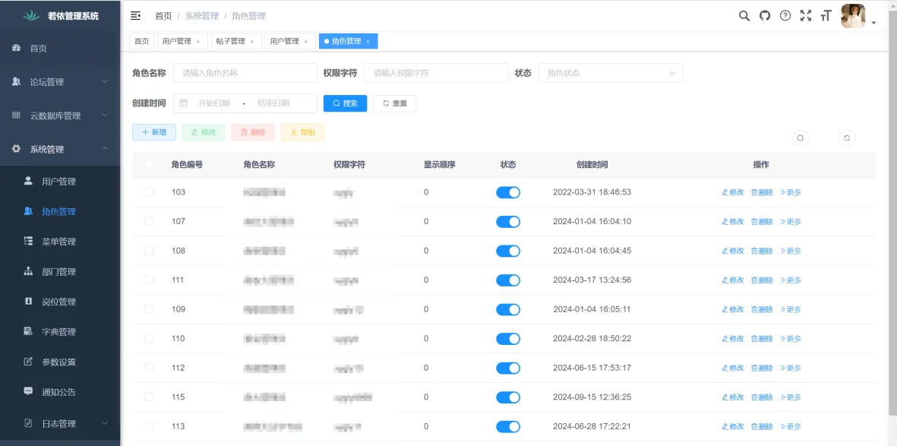

#### 1.谈校间介绍
谈校间是一款迭代超三年，经数十万真实用户及上百位流量主检验的社区论坛系统。除具备功能设计合理，页面美观实用等优点外，在网络安全、性能优化等方面也有着成熟的解决方案，能够从容应对各类实际业务场景。

##### 1.1 技术栈
+ 前端使用uni-app（Vue2语法），目前只适配了微信小程序；
+ 后端采用了Mysql+SpringBoot+MybatisPlus+redis的主流Java技术方案；
+ 管理端基于Ruoyi框架开发（感谢若依提供的开源支持）。

##### 1.2 功能亮点
+ 完善稳定的论坛基础功能（发帖评论、热榜、搜索、举报、消息中心等），以及基于微信生态的账户体系、通知、交易、小程序/公众号跳转等，便于私域经营以及流量转化变现；
+ 社群自动推送机器人、身份及实名认证、用户权限、广告设置、开通分站与管理员、内容审核与关键词拦截等，流量主需要的功能应有尽有；
+ 交友盲盒、活动报名、课程评价等引流功能与拓展模块，并会持续升级迭代...

#### 2.项目演示
##### 2.1 用户端小程序
演示案例为正式版并已上线运营的真实项目，日活3w+

也可本地快速搭建项目后体验，详见安装教程

##### 2.2 管理端后台
[体验地址](http://121.40.93.179/ruoyi-test) （测试服务器配置较低，若打不开请稍后再试，或联系客服获取）

超管账号：admin 超管密码：admin123

[查看开源版与正式版功能清单](https://www.yuque.com/kemingxinxi/eeu3o3/wkw99ybqh01a2szg?singleDoc#%20《版本区别》)

##### 2.3 用户端效果截图

##### 2.4 管理端效果截图

#### 3.安装教程
已为开源版提供了远程测试地址，可以无需搭建后端环境直接体验功能！

1. [前端安装文档](https://www.yuque.com/kemingxinxi/eeu3o3/fggugcx20ma7u327?singleDoc#%20《前端》)
2. [后端安装文档](https://www.yuque.com/kemingxinxi/eeu3o3/zuhdrf83rqpwzypn?singleDoc#%20《后端》)

如需官方提供安装服务和技术支持可联系（仅提供有偿服务）：

#### 4.补充说明
1. 代码前后端均发布了开源版，已涵盖论坛系统所需的绝大多数功能，演示案例为标准版；
2. 开源版本不适合直接商用（c端项目更注重服务器运维、网络安全、性能优化等），有相关需求建议使用正式版。我们还提供了论坛小程序的完整技术支持以及服务器全托管服务，能够大大降低项目在技术方面的投入成本。

[查看开源版与正式版功能清单](https://www.yuque.com/kemingxinxi/eeu3o3/wkw99ybqh01a2szg?singleDoc#%20《版本区别》)

#### 5.开源须知
+ 基于Apache License 2.0开源协议，前后端代码开源无加密，支持二次开发，支持商用；
+ 支持企业/个人免费商业使用，但必须保留谈校间的版权信息；
+ 不允许对程序代码以任何形式、任何目的进行再发行或出售，否则将追究侵权者法律责任；
+ 软件受国家计算机软件著作权保护（登记号： 2024SR0237614）。

